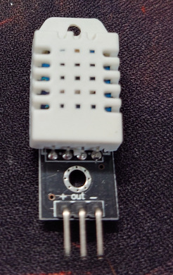

# DHT 22
The DHT 22 is a temperature and humidity sensor.

## Technical Specifications

| Specification          | Value             |
|------------------------|-------------------|
| Temperature Range      | -40 to +80 &deg;C |
| Temperature Tolerance  | +/- 0.5 &deg;C    |
| Temperature Resolution | 0.1 &deg;C        |
| Humidity Range         | 0 to 100%         |
| Humidity Tolerance     | +/- 2%            |
| Humidity Resolution    | 0.1%              |
| Operating Voltage      | 3-6V DC           |
| Current Supply         | 1 - 1.5 mA        |
| Sampling Period        | 2s                |

It has either 3 or 4 pins (the one's I have are the 3 pin variety).

## 3 Pin connector
All 3 pins are used with 1 being on the left, 3 being on the right

| Pin       | Description |
|-----------|-------------|
| 1 (left)  | + / VCC     |
| 2         | Output      |
| 3 (right) | - / GND     |

### Pin 1 : + / VCC
This is the + positive connector which should connect the 3.3v line.

### Pin 2: Output
This is the output pin which sends a digital signal via the single line indicating the temperature and the humidity.

### Pin 3 : - / GND
The - / GND (Ground) line allows a ground connector from the peripheral back to the controller.

## 4 Pin connector
The pin descriptions are identical to the 3 pin version, but this has an additional pin which is unused.

| Pin       | Description |
|-----------|-------------|
| 1 (left)  | + / VCC     |
| 2         | Output      |
| 3         | Unused      |
| 4 (right) | - / GND     |

---

When connecting this up a 10K resistor needs to be put across the + and Output pins, this can either be done at the DHT22 side, or the ESP32 side.  In order to keep things neat, I opted for the former.

Using the crimp tool, I created a 3 pin female plug, with a 10K resistor across + and Output pins to connect to the end of the DHT22 leaving the other end of the cables bare so I can use the terminal connector.

Don't forget to ensure that the cable is the right length to run from where the monitor will be positioned to the Vivarium.

Now you simply slide the DHT22 onto the cable, ensuring it's the right way around.

Lastly we need to connect it to the ESP32

Connecting the + to the 3.3v line and the - to the GND, you can then choose any other digital input GPIO pin you like for the output.

In this case I decided to use the following pins (thinking ahead)

| Vivarium | Side | Pin | GPIO |
|----------|------|-----|------|
| 1        | Cold | 3   | 36   |
| 1        | Hot  | 4   | 39   |
| 2        | Cold | 5   | 34   |
| 2        | Hot  | 6   | 35   |
| 3        | Cold | 9   | 25   |
| 3        | Hot  | 10  | 26   |

This would allow me to connect all 6 Outputs and the plan is to configure them in a configuration file so I can move them about without having to change code.

