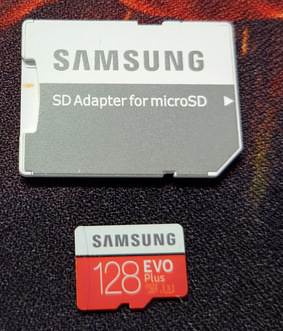
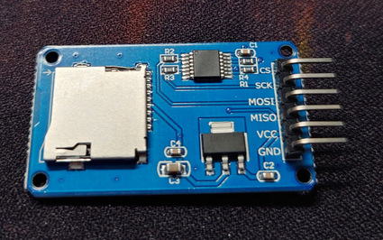
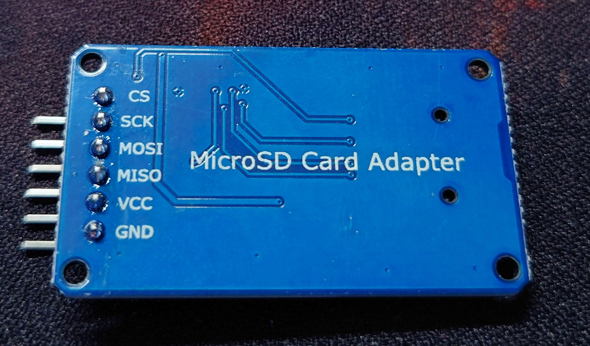
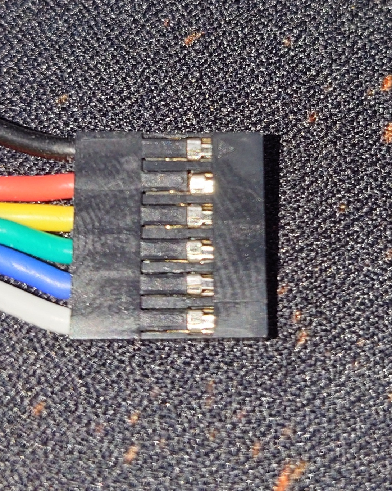
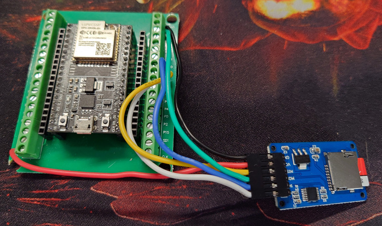

# SD Card Reader
I think we all know what an SD card is - small bit of plastic which sits in a phone or other device and allows us to store lots of data.

Let's start with getting the SD reader connected and the ESP talking to it. The ESP uses a Serial Peripheral Interface (SPI) to do this.

SPI uses a synchronous serial connection, to ensure that the controller and peripheral are running at the same speed.

SPI uses the concept of Master / Slave (now redefined as Controller / Peripheral) to allow 2 devices to talk to each other.

If you have never seen an SD Card reader before.

The SPI has 6 pins.

### MISO / POCI
`MISO (Master In/Slave Out)`, which has now replaced with `POCI (Peripheral Out/Controller In)` accepts data from the peripheral which is sent to the controller.

### MOSI / PICO
`MOSI (Master Out/Slave In)`, which has now replaced with `PICO (Peripheral In/Controller Out)` sends data from the controller to the peripheral.

### CLK / SCK
`CLK (CLocK)` is also knowns as the `SCK (Serial ClocK)`. This line runs from the controller to the peripheral and is the clock speed of the controller. 

### CS
`CS (Chip Select)` line goes low when data is being sent in either from controller to peripheral or vice versa.

### VCC
This is the positive connector which should connect to the +5v (not the 3.3V, as this won't be enough to power it).  It provides power to the peripheral.

### GND
The GND (Ground) line allows a ground connector from the peripheral back to the controller.

---

**Note: Some of the names have been redefined, the [Open Source Hardware Association](https://www.oshwa.org/a-resolution-to-redefine-spi-signal-names/) resolved to redefine SPI Signal Names.** 

---

Using the crimp tool, I created a 6 pin female plug to connect to the end of the SD Shield leaving the other end of the cables bare so I can use the terminal connector on the Breakout Board as follows:

Now I connected the SD Breakout board pins back to the ESP in the following configuration:

| ESP 32  | SD Card Reader  |
|---------|-------------|
| GPIO 19 | MISO / POCI |
| GPIO 23 | MOSI / PICO |
| GPIO 18 | CLK         |
| GND     | GND         |
| GPIO 5  | CS          |
| VCC     | 5v          |

Once hooked you connected everything up, Insert the SD Card and you can test it by loading up Arduino IDE and loading the sketch [test-sd-card.ino](../sample-apps/sdcard/test.sd-card.ino) sketch.
